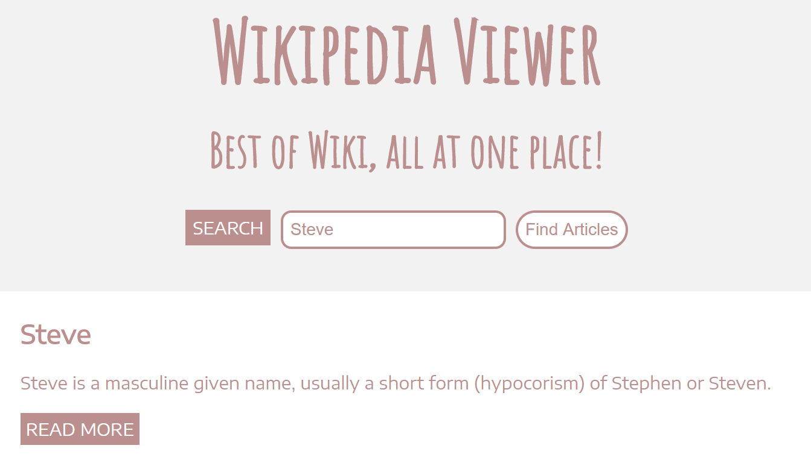

<h1 align="center">Wikipedia Viewer</h1>
<h3 align="center">Best of Wiki, All At One Place</h3>

A simple to use, all at one place Wikipedia Viewer, built using HTML, CSS &amp; JavaScript.

## Detail
Wikipedia Viewer provides a minimal, beautiful and more useful Wikipedia search experience. You can search a specific term and see all the related articles against your specific query. Among with names of related articles, you can also find a short, starting paragraph of the article and a 'Read More' link that takes you to that article.

## Design
This is how Wikipedia Viewer looks like:

## Use
You can use Wikipedia Viewer by clicking [here](https://shahzaibkhalid.github.io/wikipedia-viewer/)

# License
Wikipedia Viewer is licensed under the [MIT License](https://github.com/shahzaibkhalid/wikipedia-viewer/blob/master/LICENSE.txt).

Copyright (c) 2017 Shahzaib Khalid
